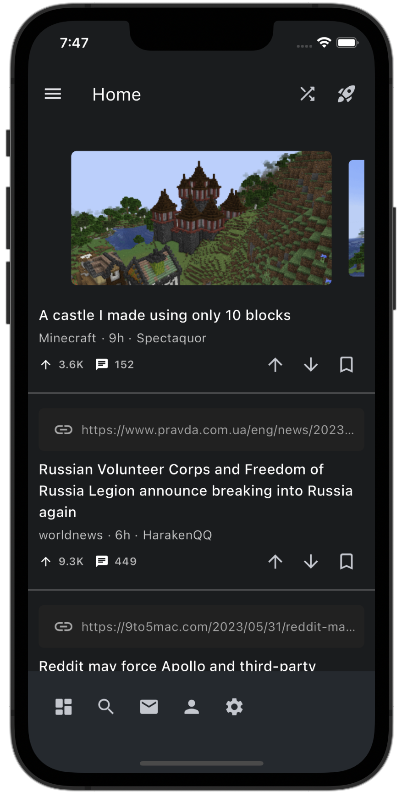
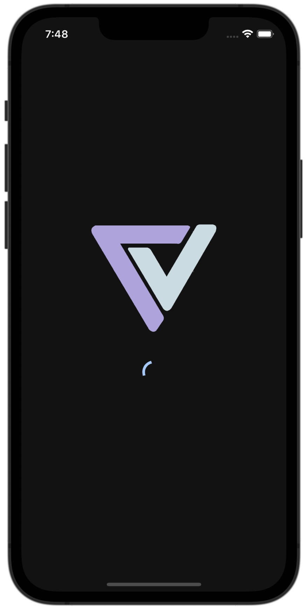

<h1 align="center">
  <br>
    
  <br>
  Spark
  <br>
</h1>

<h4 align="center">
    An open source, cross-platform Reddit client built with <a href="https://flutter.dev/" target="_blank">Flutter</a>
</h4>

<p align="center">
  <a href="">
    
  </a>
    <a href="">
    
  </a>
    <a href="">
    
  </a>
</p>

<p align="center">
  <a href="#features">Features</a> •
  <a href="#roadmap">Roadmap</a>
 
</p>

<p align="center">
   <a href="#contributing">Contributing</a> •
  <a href="#building-from-source">Building From Source</a> •
  <a href="#conventions">Conventions</a> •
  <a href="#related-packages">Related Packages</a>
</p>

<div align="center">
  <br>
    
    
    
  <br>
</div>

## Features

Spark is currently undergoing **active development**, and it is possible that not all features have been fully implemented at this stage. Due to this, significant breaking changes may occur between versions. The next section summarizes the features that are currently implemented.

#### **Subreddits & Front Pages**

- Browse front pages including **r/popular**, and **r/all**
- Browse individual subreddits through the Search function
- Browse your subscriptions when logged in through Reddit's OAuth
- Sort front pages and subreddits by **best**, **hot**, **new**, and **rising** categories

#### **Posts**

- Browse posts and view associated comments
- Upvote, downvote, and save posts when logged in through Reddit's OAuth
- Video autoplay when scrolling into view
- Link previews for external URLs when available

#### **Authentication**

- Authenticate to Reddit via OAuth without the need for a dedicated server
- View and browse subscribed subreddits

#### **Theme & Customization**

- Ability to change theme colours
- Ability to adjust font sizes

## Roadmap

Currently, work is in progress to add in more support for user actions when logged in. Some features on the roadmap are listed below.

- Improvements to comments section, and allowing the ability to perform actions on a comment (upvote, downvote, save, etc.)
- More improved native support for external links and media. Currently, Reddit and Imgur media are supported natively, with initial support for external link previews
- Improved customization and theming (compact view for posts, better theming options)
- Increased native platform support for Windows, MacOS, and Linux

## Contributing

Contributions are always welcome! To contribute potential features or bug-fixes:

1. Fork this repository
2. Apply any changes and/or additions
3. Create a pull request to have your changes reviewed and merged

## Building From Source
There are a few pre-requisites in order to build and run the application locally. Spark relies on a few external APIs and libraries to work. Thus, it is a requirement to set those up in order to develop with Spark.

### Create an Environment File
Spark uses `.env` to store secrets, including credentials for API access. This is an example of a minimal `.env` file. The Reddit credentials are the only variables that are required to run the application. However, including other API credentials will improve the overall experience while using Spark.

**Important Note**: When creating Reddit credentials, ensure that the callback URL is set to `"http://localhost:8080"`. This is because Spark uses an internal server to handle OAuth authorizations through this URL.

```dart
// [REQUIRED] Reddit specific information required to identify application
// For information on obtaining Reddit API credentials, visit "https://github.com/reddit-archive/reddit/wiki/OAuth2"
REDDIT_CLIENT_ID = ""
REDDIT_CLIENT_USER_AGENT = ""
REDDIT_CLIENT_CALLBACK_URL = "http://localhost:8080"

// [OPTIONAL] Imgur client ID is required in order to use the Imgur API
// For information on obtaining Imgur API credentials, visit "https://api.imgur.com/oauth2/addclient"
IMGUR_CLIENT_ID = ""

// [OPTIONAL] Sentry is used for error logging and debugging
// For information on obtaining Sentry credentials, visit "https://docs.sentry.io/platforms/flutter/#configure"
SENTRY_DSN = ""
```

### Installing Flutter and Related Dependencies
Spark is developed with Flutter, and supports iOS and Android.

To build the app from source, a few steps are required.
1. Create a `.env` file in the root directory as described in the previous section.
3. Set up and install Flutter.
    - For more information, visit https://docs.flutter.dev/get-started/install.
4. Clone this repository and fetch the dependencies using `flutter pub get`
5. Run the appropriate build command depending on the platform.
   - iOS: `flutter build ios --release`
   - Android: `flutter build apk`

**Note:** If Sentry is used for collecting error and debug information, the corresponding debug symbols must be uploaded. This can be done using the following command: ```flutter packages pub run sentry_dart_plugin```

## Conventions

While there are no specific conventions that must be followed, do try to follow best practices whenever possible.

Suggestions are always welcome to improve the code quality and architecture of the app!

## Related Packages
Spark uses the following packages and libraries under the hood. This is not an exhaustive list.

### Custom Built Libraries
[reddit-dart](https://github.com/hjiangsu/reddit-dart) - custom-built Reddit library built in Dart  
[imgur-dart](https://github.com/hjiangsu/imgur-dart) - custom-built Imgur library built in Dart

### Other
[sentry](https://pub.dev/packages/sentry) - used for logging error and debug information
