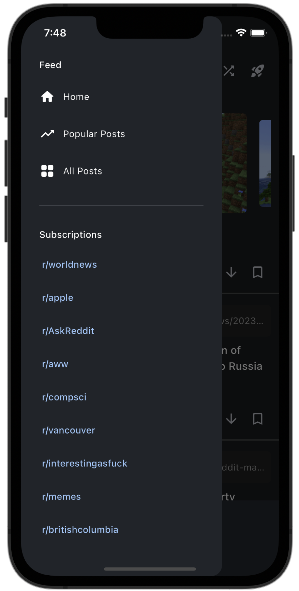

<h1 align="center">
  <br>
    
  <br>
  Spark
  <br>
</h1>

<h4 align="center">
    An open source, cross-platform Reddit client built with <a href="https://flutter.dev/" target="_blank">Flutter</a>
</h4>

<p align="center">
  <a href="">
    
  </a>
    <a href="">
    
  </a>
    <a href="">
    
  </a>
</p>

<p align="center">
  <a href="#features">Features</a> •
  <a href="#roadmap">Roadmap</a>
 
</p>

<p align="center">
   <a href="#contributing">Contributing</a> •
  <a href="#building-from-source">Building From Source</a> •
  <a href="#conventions">Conventions</a> •
  <a href="#related-packages">Related Packages</a>
</p>

<div align="center">
  <br>
    
    
    
  <br>
</div>

## Features

Spark is still under **development**, and all features may not be present yet. The following features are currently implemented.

#### **Subreddits & Feeds**

- Browse front pages including _r/popular_ and _r/all_
- Ability to sort feeds and subreddits by **best**, **hot**, **new**, and **rising**
- Ability to search for a specific subreddit

#### **Posts**

- Browse post and view associated comments
- Upvote, downvote, and save posts (if logged in via OAuth)
- Video autoplay when scrolling into view

#### **Authentication**

- Ability to authenticate via OAuth through Reddit
- View subscribed subreddits

#### **Theme & Customization**

- Ability to change theme colours
- Ability to adjust font sizes

## Roadmap

Currently, work is in progress to add in more support for user actions when logged in. Some features on the roadmap are listed below.

- Improved native support for external links and media
  - Reddit and Imgur media are currently supported
- See post awards
- Increased native platform support for Windows, MacOS, and Linux

## Contributing

Contributions are always welcome! To contribute potential features or bug-fixes:

1. Fork this repository
2. Apply any changes and/or additions
3. Create a pull request to have your changes reviewed and merged

## Building From Source
There are a few pre-requisites in order to build and run the application locally. Spark relies on a few external APIs and libraries to work. Thus, it is a requirement to set those up in order to develop with Spark.

### Create Environment File
Spark uses `.env` to store secrets, including credentials for API access. This is an example of a minimal `.env` file.

**Reddit**: to obtain your own Reddit API credentials, see the following [link](https://github.com/reddit-archive/reddit/wiki/OAuth2).  
**PubNub**: to obtain your own PubNub keys, see the following [link](https://www.pubnub.com/docs/general/setup/account-setup).  
**Imgur**: to set up your own Imgur API credentials, see the following [link](https://api.imgur.com/oauth2/addclient).  
**Sentry**: to set up Sentry, see the following [link](https://docs.sentry.io/platforms/flutter/#configure).

```dart
// Reddit specific information required to identify application
REDDIT_CLIENT_ID = ""
REDDIT_CLIENT_USER_AGENT = ""
REDDIT_CLIENT_CALLBACK_URL = ""

// PubNub is used for pushing OAuth status
PUBNUB_SUBSCRIBE_KEY = ""
PUBNUB_PUBLISH_KEY = ""

// Imgur client ID is required in order to use the Imgur API
IMGUR_CLIENT_ID = ""

// Sentry is used for error logging and debugging
SENTRY_DSN = ""
```

### Installing Flutter and Related Dependencies
Spark is developed with Flutter, and supports iOS and Android.

To build the app from source, a few steps are required.
1. Create a `.env` file in the root directory as described in the previous section.
3. Set up and install Flutter.
    - For more information, visit https://docs.flutter.dev/get-started/install.
4. Clone this repository and fetch the dependencies using `flutter pub get`
5. Run the appropriate build command depending on the platform.
   - iOS: `flutter build ios --release`
   - Android: `flutter build apk`

**Note:** If Sentry is used for collecting error and debug information, the corresponding debug symbols must be uploaded. This can be done using the following command: ```flutter packages pub run sentry_dart_plugin```

## Conventions

While there are no specific conventions that must be followed, do try to follow best practices whenever possible.

Suggestions are always welcome to improve the code quality and architecture of the app!

## Related Packages
Spark uses the following packages and libraries under the hood. This is not an exhaustive list.

### Custom Built Libraries
[reddit-dart](https://github.com/hjiangsu/reddit-dart) - custom-built Reddit library built in Dart  
[imgur-dart](https://github.com/hjiangsu/imgur-dart) - custom-built Imgur library built in Dart

### Other
[pubnub](https://pub.dev/packages/pubnub) - used to push OAuth credentials after user authentication  
[sentry](https://pub.dev/packages/sentry) - used for logging error and debug information
